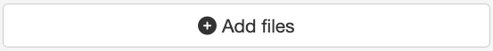
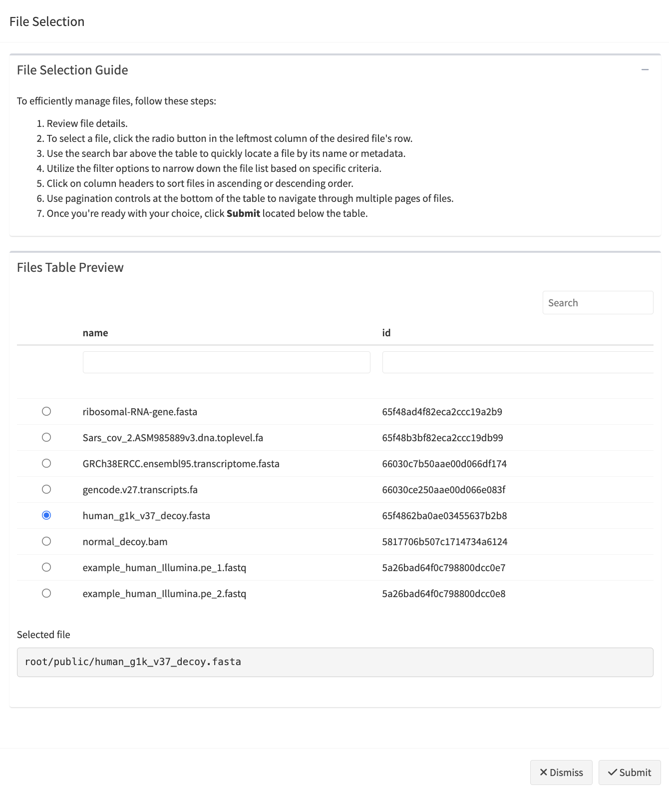
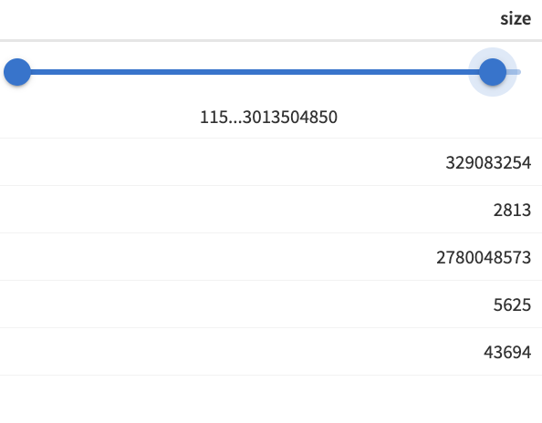
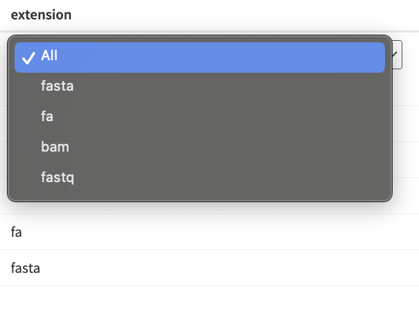
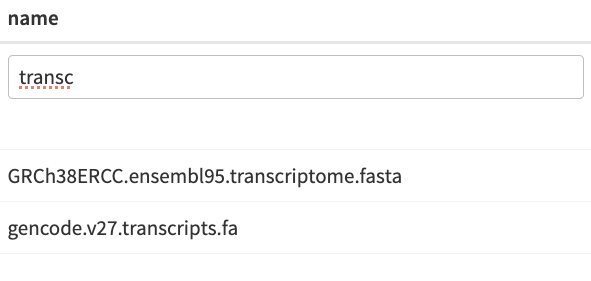
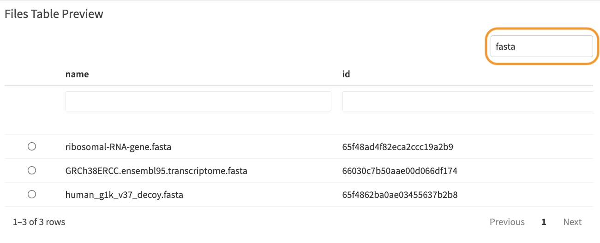

```{r, include = FALSE}
knitr::opts_chunk$set(
  collapse = TRUE,
  comment = "#>",
  eval = FALSE
)
```

## Module Overview

The File Picker Module is designed to facilitate the selection of Platform project files . It displays a table of available files, allowing users to choose files based on different criteria. It supports both single and multiple file selections and integrates seamlessly with the server-side logic of your Shiny app. By leveraging this module, you can streamline file management tasks, enhance user experience, and ensure that file selection is handled consistently across various parts of the application. 

### UI Function 

The module UI function creates an action button that triggers a modal dialog for file selection.   

<center>
  
</center>
<br>


The UI function also allows you to customize the action button icon (`button_icon` parameter) and width (`button_width` parameter) to suit the needs of your application. 


#### UI Function Call

``` {r}
mod_file_picker_ui("file_picker_1")
```


### Server Function 

  
The server function handles the logic for displaying the file picker modal and managing file selection. It provides features such as table filtering, pagination, and selection modes. The most crucial argument for this function is files_df, which is a data frame that developers must prepare and provide. This data frame should include columns for file paths and other relevant metadata. 

  

**Parameters:**

- **id**: A unique identifier for the module instance. 

- **files_df**: A data frame containing the file information. This is the most important argument, and it must include columns for the file paths and any other relevant metadata. 

- **selection**: Specifies the selection mode ('single' or 'multiple'). Defaults to 'single'. 

- **file_identifier_column**: The column in files_df used to identify selected files. Defaults to path. 

- **default_page_size**: The number of rows per page in the file table. Defaults to 10. 

- **use_bslib_theme**: Choose if the bslib theme is used for the modal UI. Defaults to FALSE. 


**Tip:** You can use the utility function `get_all_project_files()` to fetch all project files along with their metadata from the Seven Bridges File System (SBFS) that is expected to exist on the instance where the app will be hosted. This function returns a data frame containing comprehensive file information, making it an ideal input for the mod_file_picker_server() function. Check `vignette("load-files-and-metadata")` for more details about the `get_all_project_files()` function.

  

**Note:** If your Shiny app utilizes the bslib theme, ensure that `use_bslib_theme` is set to `TRUE` to maintain consistent styling across the modal dialog. 

  

#### Server Function Call

```{r}
mod_file_picker_server("file_picker_1", files_df, selection = "single")
```

Or 

```{r}
mod_file_picker_server("file_picker_1", files_df, selection = "multiple")
```
  


### File Picker Modal Dialog

  
When using the File Picker Module, you need to specify which information should be returned for the selected row(s). This is done through the file_identifier_column parameter. By default, file_identifier_column is set to path, as this is typically the most useful information for subsequent steps in the application. However, you can set this parameter to any other column in the files_df data frame that contains the desired information. 

  
It is crucial that the specified column, whether path or another value, exists in the files_df data frame provided to the module. The module will return a reactive expression containing the information from the specified file_identifier_column for the selected file(s). 


When the modal dialog for file selection opens, the module displays a preview table of files and allows users to select files based on the specified selection mode ('single' or 'multiple'). Depending on the selection mode, the table will show either radio buttons (for single file selection) or checkboxes (for multiple file selections), enabling users to choose one or more files. Below, you will find examples illustrating both single-file and multi-file picker interfaces.


<center>
  
</center>
<br>

<center>
  
</center>
<br>


#### Table options 

  
Table columns are equipped with various filter options depending on the type of data: 

- **Numeric Columns**: A range slider filter allows users to narrow down the table by selecting a range of numeric values.
<center>
  
</center>
<br>
- **Factor Columns**: A drop-down filter enables users to filter the table by selecting specific factor levels.
<center>
  
</center>
<br>
- **Other Data Types**: A basic filter with case-insensitive text matching is available for other data types.
<center>
  
</center>
<br>

Additionally, a **general search box** allows users to search the table by entering a term. This search will return all rows that contain the search term in any of their columns. <center>
  
</center>
<br>


## Example: File Picker Module in Action

The following Shiny app demonstrates the usage of the File Picker module. The example includes two versions of the file picker:

- Single File Picker: Allows users to select only one file, utilizing radio buttons for file selection.
- Multiple File Picker: Enables users to select multiple files using checkboxes.

The app utilizes a built-in data frame from the **sbShinyModules** package to populate the `files_df` parameter of the file picker module.

**Note:** To run this example on your computer, please ensure you have the **sbShinyModules** package installed.

```{r}
library(shiny)
library(sbShinyModules)
# library(bslib) # uncomment if you want to use a Bootstrap theme

# App's  UI
ui <- fluidPage(
  titlePanel("File Picker Module Examples"),
  # theme = bslib::bs_theme(), # uncomment if you want to use a Bootstrap theme
  sidebarLayout(
    sidebarPanel(
      # Single File Picker - UI
      fluidRow(
        h3("Single File Picker"),
        br(),
        sbShinyModules::mod_file_picker_ui("single_file_picker"),
        br(),
        h5("Selected File"),
        verbatimTextOutput("single_file_picker_selection", placeholder = TRUE)
      ),
      hr(),
      # Multiple Files Picker - UI
      fluidRow(
        h3("Multiple Files Picker"),
        br(),
        sbShinyModules::mod_file_picker_ui("multiple_files_picker"),
        br(),
        h5("Selected Files"),
        verbatimTextOutput("mult_files_picker_selection", placeholder = TRUE)
      )
    ),
    mainPanel(
      # Placeholder
    )
  )
)

# App's Server Logic
server <- function(input, output, session) {
  # ----------------------------- Load Files ----------------------------------
  # Load a built-in data frame for files
  files_df <- sbShinyModules::file_picker_example_data

  # Remove units (bytes) from size column and make it numeric so that it has
  # a range filter
  files_df$size <- as.numeric(gsub(" bytes", "", files_df$size))

  # Alternatively, fetch files from a provided directory (path) using the
  # get_all_project_files() utility function. Note that this requires the
  # xattrs package, which is not available for Windows systems. Therefore,
  # this approach will only work on Unix-based systems.

  # files_df <- sbShinyModules::get_all_project_files(
  #   path = "/sbgenomics/project-files"
  # )

  # ---------------------------------------------------------------------------

  ## -------------------- Single File Picker - Server Code --------------------

  # Call the file picker module
  selected_files_single_picker <- sbShinyModules::mod_file_picker_server(
    id = "single_file_picker",
    files_df = files_df,
    # use_bslib_theme = TRUE, # uncomment if you want to use a Bootstrap theme
    selection = "single",
    default_page_size = 5
  )

  # Display selected files
  output$single_file_picker_selection <- renderPrint({
    validate(
      need(
        selected_files_single_picker(),
        "No file has been selected."
      )
    )
    cat(selected_files_single_picker(), sep = "\n")
  })
  # ---------------------------------------------------------------------------


  ## ----------------- Multiple Files Picker - Server Code --------------------

  # Call the file picker module
  selected_files_mult_picker <- sbShinyModules::mod_file_picker_server(
    id = "multiple_files_picker",
    files_df = files_df,
    # use_bslib_theme = TRUE, # uncomment if you want to use a Bootstrap theme
    selection = "multiple",
    default_page_size = 5
  )

  # Display selected files
  output$mult_files_picker_selection <- renderPrint({
    validate(
      need(
        selected_files_mult_picker(),
        "No files have been selected."
      )
    )
    cat(selected_files_mult_picker(), sep = "\n")
  })
  # ---------------------------------------------------------------------------
}

# Note: To use a Bootstrap theme, ensure you have the 'bslib' package
# installed and loaded in your app.
# 1. Uncomment `library(bslib)` at the beginning of the script.
# 2. Uncomment the `theme = bslib::bs_theme()` line in the UI section.
# 3. In the server logic, set `use_bslib_theme = TRUE` in the
# `mod_file_picker_server()` function calls.

# Run the Shiny app
shinyApp(ui, server)
```
