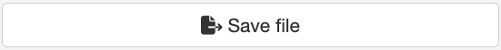

```{r, include = FALSE}
knitr::opts_chunk$set(
  collapse = TRUE,
  comment = "#>",
  eval = FALSE
)
```


## Module Overview

The Generic File Exporter Module offers a flexible and versatile solution for saving diverse types of files within a Shiny application. Unlike the specialized Plot Exporter Module, which focuses specifically on plot exporting and includes options for resizing and format selection, this module is designed to handle a broad range of file types and formats, catering to diverse file-saving needs. 


### UI Function

The UI function for this module creates a button within the Shiny app interface. Clicking this button initiates the file-saving process. This interface is minimalistic, providing a straightforward means for users to trigger file-saving operations. 

#### UI Function Call

```{r}
mod_save_file_generic_ui("file_exporter_1")
```

<center>
  
</center>
<br>

### Server Function 

The server function of the Generic File Exporter Module is responsible for executing the file-saving logic. When the user clicks the save button, this function performs necessary checks and executes a user-defined file-saving function with specified parameters. The flexibility of this module allows you to define your own file-saving functions and parameters, providing greater control over the file-saving process. 

  
**Parameters**: 

- **id**: A unique identifier for the module instance. 

- **reac_vals**: A reactive values list that must include the following fields: 

- **FUN**: The function used to create the file (e.g., write.table, save, write_json, write_xml, SaveH5Seurat...). 

- **args**: A list of arguments for the provided function. 

- **filename**: The name of the file to be saved. 

- **extension**: The expected file extension for proper validation. 

- **overwrite**: Boolean indicating if the file with the same name should be overwritten. 

- **sbg_directory_path**: Path to the mounted /sbgenomics directory, which contains project-files, output-files, and workspace sub-directories. This directory structure should mirror the Platform file system for proper integration. 

  
You as a developer are responsible for defining these parameters and integrating them with the module. You can also add additional UI components, such as file name inputs or format selectors, and use their values to populate the parameters provided to the server function. 

  
**Note**: For testing locally, you can create a mock sbgenomics directory with the required structure. 

  
**Feedback**: Users receive clear alerts regarding the success or failure of the file-saving process, ensuring they are informed of any issues or confirmations. 


#### Server Function Call 

```{r}
mod_save_file_generic_server(
  id = "file_exporter_1",
  reac_vals = list(
    FUN = write.table,
    args = list(x = my_data_frame, file = "my_file.csv"),
    filename = "my_file",
    extension = "csv",
    overwrite = TRUE
  ),
  sbg_directory_path = "/sbgenomics"
)
```


## Example: Generic File Exporter Module in Action

The following Shiny app demonstrates the usage of the Generic File Exporter module.

**Note:** To run this example on your computer, please ensure you have the **sbShinyModules** package installed.

```{r}
library(shiny)
library(magrittr)
library(sbShinyModules)
library(reactable)
library(jsonlite)


###### Test modules for demonstrating nested modules ######
test_module_ui <- function(id) {
  ns <- NS(id)
  tagList(
    actionButton(
      inputId = ns("test_module_btn"),
      label = "Test nesting modules",
      width = "100%"
    )
  )
}

test_module_server <- function(id) {
  moduleServer(id, module = function(input, output, session) {
    ns <- session$ns

    observeEvent(input$test_module_btn, {
      showModal(
        ui = modalDialog(
          title = "Test nested modules",
          size = "l",
          tagList(
            reactable::reactableOutput(ns("nested_table_data")),
            fluidRow(
              column(
                width = 6,
                sbShinyModules::mod_save_file_generic_ui(ns("save_file_nested"))
              )
            )
          ),
          footer = tagList(
            actionButton(ns("dismiss"),
              label = "Dismiss",
              icon = icon("xmark")
            )
          )
        )
      )
    })

    output$nested_table_data <- reactable::renderReactable({
      reactable::reactable(iris,
        onClick = "select",
        filterable = TRUE,
        searchable = TRUE,
        resizable = TRUE,
        defaultPageSize = 10
      )
    })

    # Close modal dialog by clicking the dismiss button
    observeEvent(input$dismiss, {
      removeModal()
    })

    # Create reactive values list with mandatory fields to pass to the module
    helper_rv_nested <- reactiveValues(
      FUN = write.table,
      args = list(x = iris, quote = FALSE, row.names = FALSE, col.names = TRUE),
      filename = "generic_file_name",
      extension = ".txt",
      overwrite = TRUE
    )
    # Call the file exporter module
    sbShinyModules::mod_save_file_generic_server(
      id = "save_file_nested",
      reac_vals = helper_rv_nested,
      sbg_directory_path = system.file(
        "tests", "testthat", "sbgenomics_test",
        package = "sbShinyModules"
      )
    )
  })
}
############## Test modules end ###########################

##### Demo App's  UI #######
ui <- fluidPage(
  titlePanel("Save data for export to Platform - Module Demo"),
  sidebarLayout(
    sidebarPanel(
      fluidRow(
        h3("Export txt/csv to Platform"),
        br(),
        textInput("file_name", label = "Set file name", width = "100%"),
        fluidRow(
          column(
            width = 6,
            selectInput("separator",
              label = "Set separator",
              choices = c("comma", "tab", "new line", "semicolon")
            )
          ),
          column(
            width = 6,
            selectInput("extension",
              label = "Set extension",
              choices = c("txt", "csv")
            )
          )
        ),
        fluidRow(
          column(
            width = 6,
            radioButtons("overwrite",
              label = "Overwrite existing file?",
              choiceNames = c("yes", "no"),
              choiceValues = c("TRUE", "FALSE")
            )
          )
        ),
        fluidRow(
          column(
            width = 12,
            sbShinyModules::mod_save_file_generic_ui(
              id = "file_exporter",
              save_button_title = "Save txt/csv"
            )
          )
        )
      ),
      fluidRow(
        h3("Export json to Platform"),
        br(),
        textInput("file_name_json", label = "Set file name", width = "100%"),
        fluidRow(
          column(
            width = 12,
            sbShinyModules::mod_save_file_generic_ui(
              id = "json_file_exporter",
              save_button_title = "Save json"
            )
          )
        )
      ),
      fluidRow(
        h3("Export RDS object to Platform"),
        br(),
        textInput("file_name_rds", label = "Set file name", width = "100%"),
        fluidRow(
          column(
            width = 12,
            sbShinyModules::mod_save_file_generic_ui(
              id = "rds_file_exporter",
              save_button_title = "Save RDS"
            )
          )
        )
      ),
      fluidRow(
        h3("Test nested modules"),
        br(),
        fluidRow(
          column(
            width = 12,
            test_module_ui(id = "nested_modules")
          )
        )
      )
    ),
    mainPanel(
      reactable::reactableOutput("table_data")
    )
  )
)

###### Demo App's Server Logic ######
server <- function(input, output, session) {
  output$table_data <- reactable::renderReactable({
    reactable::reactable(iris,
      onClick = "select",
      filterable = TRUE,
      searchable = TRUE,
      resizable = TRUE,
      defaultPageSize = 10
    )
  })

  # Create reactive values list with mandatory fields to pass to the module
  helper_rv_table <- reactiveValues(
    FUN = write.table,
    args = list(x = iris, quote = FALSE, row.names = FALSE, col.names = TRUE),
    filename = NULL,
    extension = NULL,
    overwrite = FALSE
  )

  observe(
    helper_rv_table$filename <- as.character(input$file_name)
  )
  observe(
    helper_rv_table$args[["sep"]] <- switch(input$separator,
      "comma" = ",",
      "tab" = "\t",
      "new line" = "\n",
      "semicolon" = ";"
    )
  )
  observe(
    helper_rv_table$extension <- as.character(input$extension)
  )
  observe(
    helper_rv_table$overwrite <- as.logical(input$overwrite)
  )

  # Call the file exporter module
  sbShinyModules::mod_save_file_generic_server(
    id = "file_exporter",
    reac_vals = helper_rv_table,
    sbg_directory_path = system.file(
      "tests", "testthat", "sbgenomics_test",
      package = "sbShinyModules"
    )
  )
  # Create reactive values list for json file export
  helper_rv_json <- reactiveValues(
    FUN = write,
    args = list(
      x = jsonlite::toJSON(x = iris, dataframe = "rows", pretty = TRUE)
    ),
    filename = NULL,
    extension = "json",
    overwrite = TRUE
  )

  observe(
    helper_rv_json$filename <- as.character(input$file_name_json)
  )

  # Call the file exporter module
  sbShinyModules::mod_save_file_generic_server(
    id = "json_file_exporter",
    reac_vals = helper_rv_json,
    sbg_directory_path = system.file(
      "tests", "testthat", "sbgenomics_test",
      package = "sbShinyModules"
    )
  )
  # Create reactive values list for RDS file export
  helper_rv_rds <- reactiveValues(
    FUN = saveRDS,
    args = list(
      object = iris
    ),
    filename = NULL,
    extension = "RDS",
    overwrite = TRUE
  )

  observe(
    helper_rv_rds$filename <- as.character(input$file_name_rds)
  )

  # Call the file exporter module
  sbShinyModules::mod_save_file_generic_server(
    id = "rds_file_exporter",
    reac_vals = helper_rv_rds,
    sbg_directory_path = system.file(
      "tests", "testthat", "sbgenomics_test",
      package = "sbShinyModules"
    )
  )

  # Call test module
  test_module_server(id = "nested_modules")
}

###### Run the Shiny app #######
shinyApp(ui, server)
```
