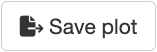
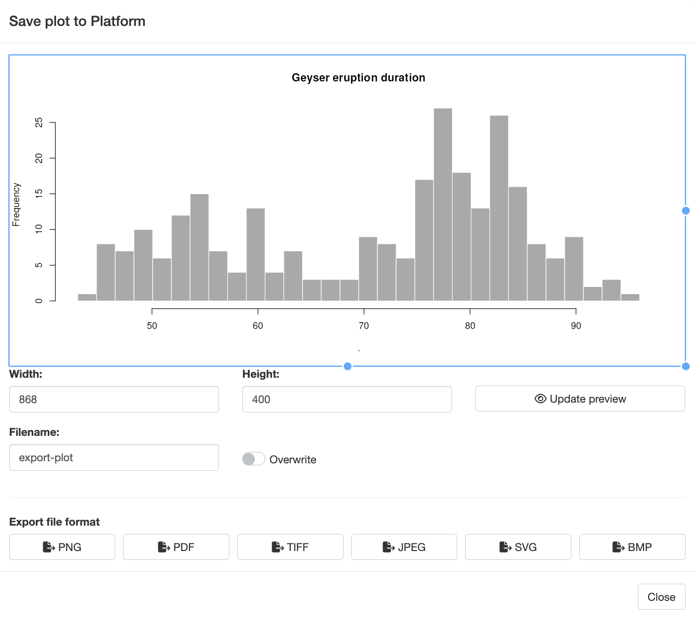
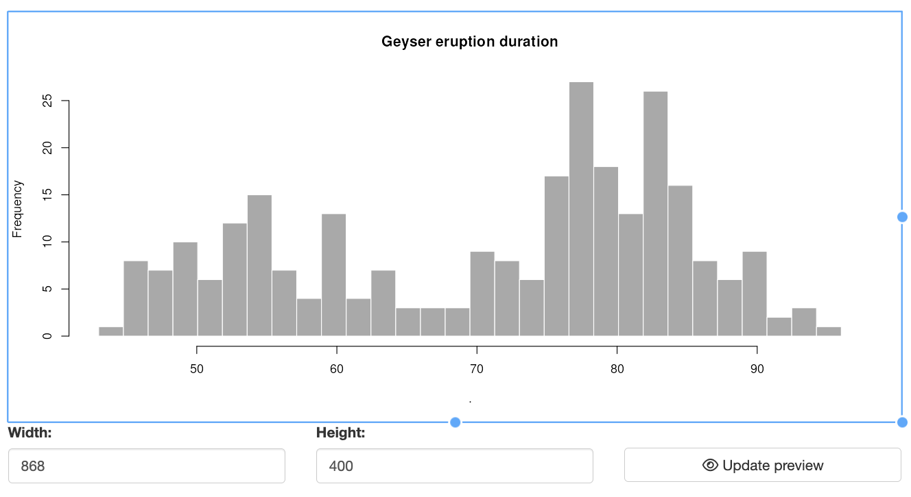
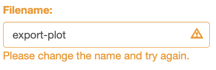
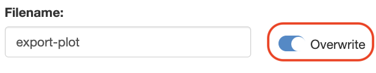
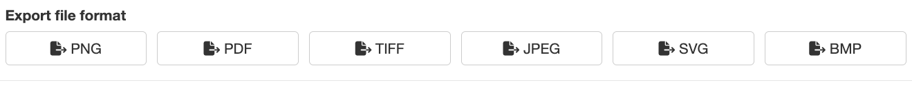

```{r, include = FALSE}
knitr::opts_chunk$set(
  collapse = TRUE,
  comment = "#>",
  eval = FALSE
)
```


## Module Overview

The Plot Exporter Module enables users to save and export plots generated within a Shiny app to the Seven Bridges Platform. This module provides a user-friendly interface for exporting plots in various formats and integrates seamlessly with the server-side logic of your Shiny app. 


### UI Function

The UI function for the Plot Exporter Module creates an action button that triggers a modal dialog for exporting plots. This modal dialog includes settings for selecting output formats and managing export options. 

  
**Parameters**: 

- **id**: A unique identifier for the module instance. 

- **save_button_title**: The label for the button that triggers the export modal. 


#### UI Function Call

```{r}
mod_plot_exporter_ui("plot_exporter_1", save_button_title = "Save Plot")
```

<br>
<center>
  
</center>
<br>


### Server Function 

The server function handles the logic for exporting plots. It integrates with reactiveValues to manage the plot object and provides settings for output formats and directory paths. This function is crucial for enabling users to export plots in various formats and save them to the Seven Bridges Platform. 

  
**Parameters**: 

- **id**: Module's ID. 

- **plot_reactVals**: A reactiveValues object containing a plot slot with the plot object created using recordPlot(). This is the plot which will be exported. 

- **output_formats**: The supported output formats for exporting the plot. Options include "png", "pdf", "svg", "jpeg", "bmp", and "tiff". 

- **module_title**: The title displayed in the modal dialog top-left corner. 

- **sbg_directory_path**: Path to the mounted /sbgenomics directory, which should include project-files, output-files, and workspace sub-directories. This directory structure must exist on the instance where the app runs. For local testing, create a mock directory with the same structure and populate it with test files. 

- **btns_div_width**: Width of the div() containing the buttons for saving plots in the modal dialog. Default is 12. 


#### Server Function Call

  
```{r}
mod_plot_exporter_server(
  id = "plot_exporter_1",
  plot_reactVals = helper_reactive,
  output_formats = c("png", "pdf"),
  module_title = "Export Plot",
  sbg_directory_path = "/sbgenomics",
  btns_div_width = 12
)
```


**Note**: If you are developing a Shiny application that will be hosted on-demand on the Seven Bridges Platform, the sbg_directory_path parameter should be set to the default value of `/sbgenomics`. This path points to the /sbgenomics directory, which already includes the project-files, output-files, and workspace sub-directories. For local testing of your application, you can create a mock sbgenomics directory with the same structure—containing project-files, output-files, and workspace sub-directories. Populate this mock directory with test files that replicate the project file structure on the Platform. 

<br>
<center>
  
</center>
<br>

### Plot Exporter Module: Modal Dialog Features 

When users click the Save Plot button, a modal dialog appears, offering several advanced features for customizing and exporting the plot.

The modal dialog provides two options for resizing the plot before saving: 

#### Plot Resizing

The modal dialog provides two options for resizing the plot before saving: 

- **Interactive Resizing**: Users can drag and resize the plot box using a cursor. This functionality leverages the React Moveable library, allowing users to adjust the plot dimensions directly. As users resize the box, the plot within it automatically adjusts to fit the new size, and the modal dialog resizes accordingly to accommodate the updated plot dimensions. 

- **Manual Resizing**: Users can also specify the plot width and height manually. By entering the desired dimensions and clicking the "Update Preview" button, the plot and modal dialog will adjust to reflect the new size. This option provides precise control over the plot appearance. 

<center>
  
</center>
<br>


#### File Naming and Valdation

The modal dialog includes a text input element where users can set the name (base name) for the plot file. Key aspects of this feature include: 

- **File Name Validation**: The module performs real-time validation to check if a file with the same name (base name + extension) already exists in the project directory or if it is previously saved within the same session (stored in the output-files). If a conflict is detected, a warning message is displayed near the text input field, prompting users to choose a different name. 

<center>
  
</center>
<br>

- **Overwrite Option**: For cases where users prefer to overwrite an existing file, an overwrite switch is available. This option allows users to save the plot with the same name, regardless of existing files in the project directory. 

<center>
  
</center>
<br>


#### File Format Selection

At the bottom of the modal dialog, users can choose from various file formats for exporting the plot. This section includes: 

- **Format Buttons**: The dialog features buttons for the default file formats: PNG, PDF, SVG, JPEG, BMP, and TIFF. The specific formats available are controlled by the output_formats parameter in the mod_plot_exporter_server() function. By default, all six formats are shown, but you can limit the options to a subset of these formats. 

<center>
  
</center>
<br>

- **Saving the Plot**: Clicking a format button triggers the plot export process, using the specified base name and the selected file extension. This action also invokes the file name validation mechanism described above, ensuring that users are alerted to any potential conflicts before saving.


**Please Note**: By default, plot files are saved in the `/sbgenomics/output-files` directory. Once the Shiny app is stopped, these files will be accessible from the "Files" tab of the project from which the app was launched.


## Example: File Picker Module in Action

The following Shiny app demonstrates the usage of the Plot Exporter module.

Keep in mind that the UI function only creates the button for triggering the export, and the server function handles the export settings and file saving.

**Note:** To run this example on your computer, please ensure you have the **sbShinyModules** package installed.

```{r}
library(shiny)
library(magrittr)
library(sbShinyModules)

# App's  UI
ui <- fluidPage(
  titlePanel("Save plots for export to Platform - Module Demo"),
  sidebarLayout(
    sidebarPanel(
      sliderInput("bins",
        "Number of bins:",
        min = 1,
        max = 50,
        value = 30
      )
    ),
    mainPanel(
      plotOutput("distPlot"),
      fluidRow(
        h3("Export Plot to Platform"),
        br(),
        sbShinyModules::mod_save_plot_to_export_ui(
          id = "plot_exporter"
        )
      )
    )
  )
)

# App's Server Logic
server <- function(input, output, session) {
  # Create reactive values list with plot field
  helper_reactive <- reactiveValues(
    plot = NULL
  )

  plot_output <- eventReactive(input$bins, {
    bins <- input$bins + 1

    # Draw the histogram with the specified number of bins
    faithful[, 2] %>%
      hist(
        breaks = seq(min(.),
          max(.),
          length.out = bins
        ),
        col = "darkgray",
        border = "white",
        main = "Geyser eruption duration"
      )
    helper_reactive$plot <- recordPlot()
  })

  output$distPlot <- renderPlot({
    plot_output()
  })

  # Call the plot exporter module
  sbShinyModules::mod_save_plot_to_export_server(
    id = "plot_exporter",
    plot_reactVals = helper_reactive,
    module_title = "Save plot to Platform",
    sbg_directory_path = system.file("demos/sbgenomics_test",
      package = "sbShinyModules"
    ),
    btns_div_width = 12
  )

  # Note: This way the plot will be saved in a specific directory within the
  # package installation path. To find this default location, you can use the
  # following R command to determine the installation path of the
  # sbShinyModules package:
  #
  # find.package("sbShinyModules")
  #
  # Within this directory, exported files will be placed under:
  #
  # demos/sbgenomics_test/output-files
  #
  # You can specify your own destination directory for exported files by
  # setting the sbg_directory_path parameter in the
  # mod_save_plot_to_export_server() function. Ensure that the custom directory
  # you choose follows the required organizational structure for proper
  # functionality. Refer to the sbg_directory_path parameter description in the
  # documentation for detailed requirements.
}

# Run the Shiny app
shinyApp(ui, server)
```
